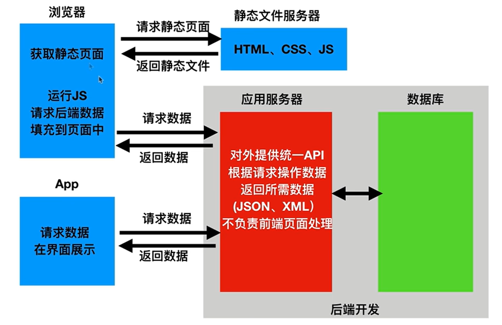
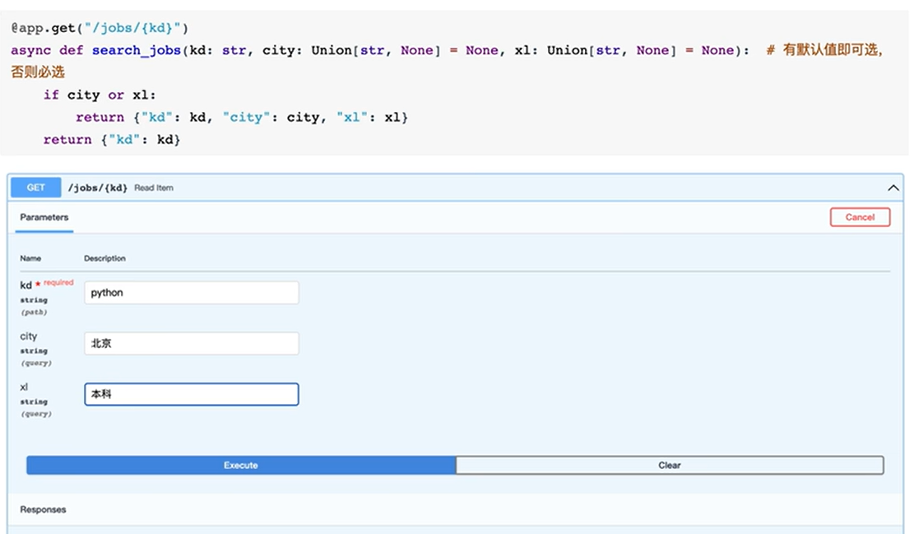

## 知识总览

django大而全、flask小而精、FastAPI快

Python并发能力弱，源于它有一把GIL锁限制了多核下的一个线程并发（疑似3.14版本解决），所以突破瓶颈的一个方式就是基于携程异步 => FastAPI

在目前前后端分离为主流的情况下，API的开发尤其重要。所以FastAPI与同样小而精的Flask有了差异，FastAPI更偏向于数据接口开发，而Flask对于前后端分离和不分离的侧重是一样的。

Python Web领域，在数据接口开发方向上，使用率最高的组件是DRF，它作为Django的一个数据接口开发组件，不仅功能强大，而且组件丰富，在接口文档上做的特别优秀。而FastAPI在该方向一部分借鉴了DRF，并做了提升，所以它的接口文档也是全部自动生成，且参数配置更加方便。可以把FastAPI理解成是Flask的API强化版本

FastAPI的两大核心组件：Starlette和Pydantic，Starlette负责web部分（异步`asyncio`），Pydantic负责的是数据部分（类型提示）

WSGI是同步的web协议、ASGI是包含异步服务的web协议，而Starlette是基于ASGI框架的


## HTTP协议

### HTTP请求协议

HTTP是一个属于应用层的面向对象的协议，基于TCP协议、请求-响应模式，所以必须客户端先发消息。后面会学到Web Socket协议，支持双向通信，可收可发（聊天室）。

另外http协议无状态保存，即在http这个层级，协议对于发送过的请求或响应都不做持久化处理。


http请求中get请求会把数据放在路径后面作为一个请求参数（用?隔开），而post请求会把数据放在请求体里面（这是**get和post的一个核心区别：数据放在哪里**）

请求协议的请求首行包括三个部分：请求方式（get/post）、请求路径、请求协议（http 1.0或http 1.1）

请求头包含浏览器发给服务器的信息，是由若干键值对组成的，以下是比较重要的：

**user-agent**，用于表明发出请求的身份（浏览器）。最简单的爬虫程序一般不带这个键，所以一些服务器如果希望做一些反爬虫措施，那么就可以查询这个键，这是最简单的一种反爬措施。（更深一层的爬虫程序可以通过加一个`user-agent`键来模拟浏览器访问，从而攻破那一层反爬，然后服务器则需进行更深一层的反爬措施……）

**Content-type**，相当重要，用于告诉服务器请求体中数据的类型和格式（`json`、`urlencoded`）。服务器接收到请求时，先去看请求头中的`Content-type`，才能正确地解析请求体中数据。

请求头与请求体之间必须有一个空行作为分隔符，请求体是放核心数据的，比如用户名密码等隐私信息。而get请求没有请求体，所以它会把一些隐私数据显式地放在路径后面，非常不安全。此外请求体没有长度限制，所以post方法传输数据要比get方法容量更大


### HTTP响应协议

包含三个部分：响应首行、响应头、响应体：
响应首行包含协议格式、状态码、状态码的解释
响应头由一系列键值对组成，描述响应时间、响应体长度、响应体数据格式等信息
响应体包含服务器根据用户请求返回的数据（同样会用空格与响应头隔开）


在开发Web应用中，有两种应用模式：

1.前后端不分离，客户端看到的内容和所有界面效果都是由服务器提供出来的


2.前后端分离，把前端的界面效果（html、css、js）分离到另一个服务器，python服务端只需要返回数据即可。前端形成一个独立的网站，服务端形成一个独立的网站。另外前端无论是浏览器还是APP，后端都不关心，后端只专注于数据



目前市面上大部分公司开发人员使用的接口实现规范主要有：restful、RPC

restful：**面向资源开发**。例如初级开发人员喜欢用不同的路径来映射不同的函数，完成不同的操作：/student/select表示查询操作，/student/add表示添加操作。但restful是面向资源的，**它不希望路径中存在任何的动作**，而是基于某个资源的增删改查操作，该例中如果用restful，那么路径就只有/student，然后使用不同的请求动作来表述对数据的增删改查：增POST、删DELETE、查GET、改UPDATE等。且restful是一种**通用规范**，不限制语言和开发框架的使用。

当客户端发送一个http请求后，先通过uvicorn接收（uvicorn相当于在FastAPI框架外面封装了一个socket），然后把请求处理好的数据再交给Web应用程序或Web框架（由路由系统映射函数完成）。也就是到了Web框架这一层级时，一定要有一个路由映射函数的机制，即对于不同请求对应的不同路径，将其交给不同的函数处理。

学习web框架必须记住这个流程：（uvicorn封装 ->）路由系统 -> 逻辑函数（请求参数 -> 响应方式），其中，在响应过程中需要数据库操作即ORM。另外模板引擎、中间件也在其中作用


###  路径操作

#### 1 路径参数
路径操作装饰器：`@app.get()`等一系列装饰器
`include_router`：做路由分发，实现不同子应用对于路径的解耦，让有多个子应用的时候，不要把所有的路由写到一起。比如如果都用`@app.get("/get")`、`@app.post("/post")`、`@app.put("/put")`等，那么所有的路由都在app下，对于一个有很多子应用的大项目，需要将其划分。
```python
@app1.get("/user/{id}")
def get_user(id):
    print("id",id, type(id))	# id 12 <class 'str'>	
    return {
        'user_id': id
    }
```

通过路径中的变量获取参数，且路径上传送给路由函数的任何参数都是字符串类型


如果想要传递特定类型的参数，如int，那就可以使用类型标注：

```python
@app1.get("/user/{id}")
def get_user(id: int):	# 更改此行
    print("id",id, type(id))	# id 12 <class 'int'>
    return {
        'user_id': id
    }
```

此时从路径上获取的一个字符串类型的参数，则会尝试转换成int类型。

此外，如果变量中如果取到了某个值，使得路径成为一个已有对应路由的静态路径。那么结合路径查找的机制：从程序内从上往下依次查询，如果这个静态路径在前，那么就会执行静态的。

```python
@app1.get("/user/1")
def get_user():
    return {
        'user_id': 'root user'
    }


@app1.get("/user/{user_id}")
def get_user(user_id: int):
    print("user_id", user_id, type(user_id))
    return {
        'user_id': user_id
    }
```

比如接口如果传入`user_id`为1的话，就会执行另一个方法，返回的就不是`user_id`，而是`root user`。但是如果把这两个接口的顺序调换，那么`root user`将永远不会被输出，但一般不会这么做，一般会让给定的静态路由放到最前面。

**这类似计算机网络的特定主机路由。因为是最具象的，所以后缀是/32（以ipv4为例），根据最大长度匹配原则和路由器IP存放顺序由具体到抽象，所以这些特定主机路由是最先访问的。fastapi的设计也一样，把最重要的一些特殊方法，如对于特殊用户id返回管理员身份而不是视为普通用户**。利用这个机制，而不是之间把判断id是否为管理员放进方法的实现中，减少了每次普通用户访问时进行的多余的判断（因为本来就要从上至下查找接口，如果执行到了那个方法的话，说明一定是普通用户），不仅让效率上升还让代码整洁美观

#### 2 查询参数（请求参数）

http请求报文中，请求首行的路径末尾问号?后跟的就是请求参数，这是get和post方法都能使用的，注意区分。这一部分内容在于该部分的数据如何被fastapi获取到。（上小节的路径参数是解释问号?前面能够完成的事情）

路径函数中声明不属于路径参数的其他函数参数时，它们会自动解释为“查询字符串”参数，就是url?之后用&分割的key-value键值对。（有时候路径参数和查询参数没有什么太大的区别）



#### 3 请求体数据 JSON格式

FastAPI基于Pydantic，Pydantic主要用来做**类型强制检查**（校验数据），而且类型限制可以嵌套。另外，当想对任意一个字段做一个校验规则时，可以直接在类里面声明一个函数加上@field_validator装饰器

```python
class User(BaseModel):
    name: str = Field(pattern="^a")	# 正则表达式限制，名字以a开头
    age: int = Field(default=10, gt=0, lt=100)
    birthday: Union[date,None] = None
    friends: List[int] = []
    description: Optional[str] = None
    
    @field_validator('name')
    def name_must_alpha(cls, value):
        assert value.isalpha(), "name must be alphanumeric"
        return value
    
```

#### 4 请求体数据 from表单格式

fastapi中使用form组件来接收表单数据，需要在接口方法的参数中令其等于Form()，不然就会作为查询参数

```python
@app4.post("/register")
async def data(username: str = Form(), password: str = Form()):
    print(f"Username: {username}, Password: {password}")
    return {
        "username": username
    }
```


同样，以上的这些所有fastapi测试文档中测试的请求，都可以通过postman发送，但是它是一种最原始最客观的发送方式。fastapi文档是基于后端代码实现的，所以借助浏览器发送规范请求的他特别方便测试，但是现实情况不是所有前端都是像fastapi那样规范，此时postman就是一个很客观的，模拟对后端一无所知的前端开发者的测试工具。

#### 5 文件上传

文件数据上传同form、json格式数据，都是放在请求体里面的。只不过放在请求体里的文件数据，会采用一个新的`content-type`——`multipart/form-data`，具有对大字节流数据的截断方式，且文件是属于字节流，所以类型标注时不用str而是用bytes，且不同于form表单使用`Form()`，而是使用File() 

**上传单个小文件：**

```python
@app5.post("/file")
async def get_file(file: bytes = File()):
    # 适合小文件上传，因为整个文件都被file对象接收，进入内存
    print("file", file)
    return {
        "file": len(file)
    }
```

**上传多个文件：**

```python
@app5.post("/files")
async def get_files(files: List[bytes] = File()):
    for file in files:
        print(len(file))
    return {
        "files": len(files)
    }
```

可以注意到，上面两个函数的参数类型不同，一个是`bytes`，一个是`List[bytes]`，但是它们的默认值都是`File()`的实例化对象。这是因为**在FastAPI中，File()是一个特殊的依赖项声明，而不是普通的默认值。`= File()`实际上是在告诉FastAPI这是一个依赖项，且依赖项的类型是`File()`，要按照`File`类的逻辑来处理这个函数。** 而`File()`带有适配功能，无论是接收单个文件还是多个文件，都能够通过简单的`=File()`来自动完成业务逻辑。

**Q：** 同样是解释器的**函数参数赋默认值的语法，为什么FastAPI能够用来声明依赖项**？`FastAPI`是如何“劫持”解释器的？

**A：** FastAPI并没有真正劫持解释器，FastAPI利用了Python的语法特性——默认值在函数定义时计算（这里的计算指的是函数定义时，执行`File()`，**得到一个`File`类的实例，并将该实例作为该参数的默认值存储起来，位置在函数的`__default__`属性中**），并且可以通过**检查函数的签名**来获取这些默认值。

FastAPI将**计算结果（`File()`实例默认值）作为“标记”来声明API参数类型**，即FastAPI根据这些默认值的类型来决定如何获取实际的参数值。然后在运行时用实际请求数据来替换这些标记。所以它**不会使用这个默认值，而是从请求中读取文件数据**，然后将文件数据作为参数传递给函数。

这就是所谓的“声明式”编程：你声明参数应该是什么，而由框架来负责如何获取它，无需关心怎么做。这是现代框架（如FastAPI、React、Kubernetes）的核心设计哲学。

**使用文件句柄方式上传单个文件（可上传大文件）：**

使用`UploadFile`，此时输出的file不再是整个文件的所有内容（字节流），而是一个文件句柄。

```python
@app5.post("/uploadFile")
async def get_files(file: UploadFile):
    print("file", file)
    return {
        "file": file.filename
    }
    
"""
输出结果：（原本输出没有格式）
file UploadFile(
	filename='笔记20250403【海量资源：kebaiwan.net】.txt', 
	size=4516, 
	headers=Headers({
		'content-disposition': 'form-data; 
		name="file";
		filename="ç¬\x94è®°20250403ã\x80\x90æµ·é\x87\" +
		"x8fèµ\x84æº\x90ï¼\x9akebaiwan.netã\x80\x91.txt"', 
		'content-type': 'text/plain'
		})
    )
"""
```

真正地实现文件上传，保存在与apps并列的目录imgs下（其他文件也可以）：

```python
@app5.post("/uploadFile")
async def get_file(file: UploadFile):
    print("file", file)
    upload_dir = "imgs"
    os.makedirs(upload_dir, exist_ok=True)

    path = os.path.join(upload_dir, file.filename)
    # 文件保存
    with open(path, "wb") as f:
        for line in file.file:
            f.write(line)

    return {
        "file": file.filename
    }
```

**使用文件句柄方式上传多个文件（可上传大文件）：**

```python
@app5.post("/uploadFiles")
async def upload_files(files: List[UploadFile]):
    print("files", files)

    upload_dir = "uploadFiles"
    os.makedirs(upload_dir, exist_ok=True)

    for file in files:
        # print("file.filename:", file.filename)
        path = os.path.join(upload_dir, file.filename)
        # 文件保存
        with open(path, "wb") as f:
            for line in file.file:
                f.write(line)

    return {
        "names": [file.filename for file in files]
    }
```

#### Request对象

```python
@app6.post("/items")
async def items(request: Request):
    print("url:", request.url)
    print("客户端IP地址:", request.client.host)
    print("客户端浏览器信息:", request.headers.get("user-agent"))
    print("cookies:", request.cookies)
    return {
        "url:": request.url,
        "客户端IP地址:": request.client.host,
        "客户端浏览器信息:": request.headers.get("user-agent")
    }
```

这里的`request`对象在传参时用`request: Request`，表示`request`不再是查询参数。这不同于之前的`=Form()`和`=File()`。这展示了FastAPI依赖注入系统的另一个精妙之处，它比起传递实例的`=File()`方式，要更为直接：

| 特性       | `=File()` 方式       | `request: Request` 方式 |
| :------- | :----------------- | :-------------------- |
| **语法**   | 有默认值语法，自动处理，简单     | 纯类型注解，手动控制，灵活         |
| **作用**   | 声明要提取特定数据          | 获取完整的请求对象             |
| **内部处理** | 依赖注入系统             | 直接参数解析                |
| **是否必需** | 可以设置`File(None)`可选 | 总是会注入                 |

原理：FastAPI在启动时扫描所有的路由函数，解析所有函数的参数。Request直接来自FastAPI的底层框架Starlette，**它被FastAPI直接识别为”要注入的对象“**。T是一个特殊类型，因为每个请求只有一个`Request`对象，所以它完美地符合单例模式，且`Request()`需要运行时创建（等请求来了才能获取到），所以函数定义时传入它没有任何意义。

**FastAPI的`=File()`方式与`request: Request`方式体现了两种程序设计的哲学：前者是声明式编程，它表示声明自己需要一个文件，然后由FastAPI等框架来处理好细节；后者是命令式访问，它要求把原始数据Request对象交给自己，自己来进行处理。**

用`request: Request`：

1. 需要原始请求信息（headers、cookies、IP等）
2. 要手动处理某些特殊数据
3. 调试或记录请求详情

用`=File()`：

1. 只需要特定数据，不关心完整请求
2. 想让FastAPI自动验证和转换
3. 希望代码更简洁、声明式


`=File()`的智能匹配，那是通过依赖项与类型标注一同作用后得到的。 但是某些时候，可能不会用列表来装一堆文件，而是分成若干个`file`行参来接收对应的文件。此时对于`=File()`来说，标注类型全是单个文件，但是这就使得`File`的标记存在多个。所以可以出现这种情况：在一个函数的参数中，第一个形参类型是字节流列表，包含多个文件，后面几个参数是字节流，仅包含一个文件。`=File()`的机制能够让这两种类型同时存在于一个函数的形参中。所以`File`的标识度并不如`Request`这种一个请求仅一个的那么高。

#### 请求静态文件

不是由Web服务器生成的文件称为静态文件，如css/js和图片文件等。动态文件则是在请求过程中动态地渲染生成的文件。

#### 响应模型相关参数

**response_model :** 之前小节的函数return的都是自定义结构的字典，FastAPI提供的该参数，声明了return响应体的模型，它是一个路径操作参数，而不是路径函数的参数。`response_model`让参数在输出时以该参数定义的类型输出。

举例：通过`response_model`实现用户注册隐私保护（返回信息中不包含密码）

```python
class UserIn(BaseModel):
    username: str
    password: str
    email: EmailStr
    full_name: Union[str, None] = None


class UserOut(BaseModel):
    username: str
    email: EmailStr
    full_name: Union[str, None] = None


@app7.post("/create_user", response_model=UserOut)
def create_user(user: UserIn):
    # 存到数据库
    # 这个user对象仍然是原来传进来的包含密码的user对象，
    # 但是在最后返回前会经过response_model=UserOut处理
    return user
```

**response_model_exclude_unset :** 返回值中排除未设置的值

**include&exclude :** 传入集合，返回值中包含&排除某些字段


### jinja2模板

要了解jinja2，那么需要先理解模板的概念，模板在Python的Web开发中广泛使用，它能够有效地将业务逻辑和页面逻辑分开，使代码可读性增强，并且更加容易理解和维护。

模板简单来说就是一个其中包含占位变量表示动态的部分的文件，模板文件在经过动态赋值后，返回给用户。

jinja2是Flask作者开发的一个模板系统，起初是仿django模板的一个模板引擎，为Flask提供模板支持，由于其灵活，快速和安全等优点被广泛使用。

在jinja2中，存在三种语法：

1. 变量取值：{{}}，在后端可以通过字典传值
2. 过滤器：|，如{{name|upper}}，会让name输出时首字母换大写
3. 控制结构：

```jinja2
# 分支控制

	<ul>
		<li>if判断成功</li>
	</ul>

	<ul>
		<li>if判断失败</li>
	</ul>


# 循环控制

	<p>{{ book }}</p>	# 其实无需缩进

```

FastAPI侧重于接口开发，是前后端分离的模式，而jinja2是前后端不分离的模式


### ORM

在后端开发时，对数据库的增删改查可以使用原生的SQL语句。但是为了更好地配合编程语言高效地完成任务，通常会使用ORM（Objection Relation Mapper，对象关系映射器）FastAPI没有自带的ORM，官方推荐SQLAlchemy（在Flask中用的最多），这里使用对异步支持非常友好的Tortose ORM


### 中间件与CORS

#### 中间件

中间件是一个函数，它在每个请求被特定路径操作处理之前，以及每个响应之后工作。原先的流程是，当客户端发来一个请求给FastAPI框架（中间经由`uvicorn`的封装，将HTTP请求解析并转换为ASGI格式），然后在框架内通过路由机制，找到对应的逻辑函数（通过 @app.操作 装饰的函数），逻辑函数再通过业务逻辑对数据库增删改查，再返回结果。

在这个过程中，如果希望在所有或是一组逻辑函数运行前，先执行一些操作（如打开日志、反爬虫机制等），那么每个函数都添加这个操作太繁琐，所以就出现了中间件。

每个中间件是一个包含请求和响应处理的代码块，它接受请求，调用下一层，再处理响应，三步写在一个函数里，但是操作不一定全要写：比如对请求处理，一个IP黑名单的请求处理机制，它在发现访问者IP在黑名单中就直接返回`Forbidden`，与响应处理无关；对于响应处理，一个将请求头添加作者的机制，它与请求处理无关。

此外中间件可以多层（洋葱模型，且**谁在最外层就写在最下面**），执行时就按照排列顺序，请求时就从客户端到逻辑函数依次执行中间件的请求部分，响应时就从逻辑函数到客户端依次执行中间件的响应部分。

```python
@app.middleware('http')
async def m2(request: Request, call_next):
    # 请求代码块
    print("m2 request")
    response = await call_next(request)
    # 响应代码块
    print("m2 response")
    return response


@app.middleware('http')
async def m1(request: Request, call_next):
    # 请求代码块
    print("m1 request")
    response = await call_next(request)
    # 响应代码块
    print("m1 response")
    return response


@app.get("/user")
async def get_user():
    print("get_user函数执行")
    return {
        "user": "current user"
    }

@app.get("/item/{item _id}")
def get_item(item_id: int):
    print("get_item函数执行")
    return {
        "item_id": item_id
    }
    
"""
输出顺序是：
m1 request
m2 request
get_user函数执行
m2 response
m1 response
INFO:     127.0.0.1:58117 - "GET /user HTTP/1.1" 200 OK
"""
```

#### CORS

CORS，指跨源资源共享。同源策略是现代浏览器最基本的一种安全策略之一，它**限制来自不同源的文档或脚本如何与当前源的资源进行交互**。一个"源"由三部分组成：

1. **协议**（protocol）- http/https
2. **域名**（domain）- [www.example.com](https://www.example.com/)
3. **端口**（port）- 80、443、3000等

**如果三要素完全相同，就是同源；任何一个不同，就是不同源（跨域）。CORS允许服务器**明确告诉浏览器**哪些源可以访问其资源。服务器通过在响应中添加特定的HTTP头部来实现。

CORS本质上等价于一个中间件，在响应返回的处理时，通过`response.headers['Access-Control-Allow-Origin']`，以及其他参数的调整，让浏览器在发现跨域访问时仍然能够放行。因为这类需求很常见，所以fastapi将它集成了，可以通过`CORSMiddleware`来精准地按照业务逻辑控制跨域访问权限。由于CORS头部需要在响应最终发送前添加，而且通常不依赖其他中间件的处理结果，所以**CORS中间件通常放在最外层**（最先添加）。


### 依赖注入

依赖注入是一种**控制反转**的设计思想，它将对象的依赖关系从内部创建转变为外部提供。核心是让组件**声明自己需要什么**，而不是自己**创建或查找**依赖。就像餐厅点餐：只需告诉服务员要什么菜（声明依赖），厨房会做好送上来（注入依赖），而不需要自己进厨房做菜（创建依赖）。

在FastAPI中，通过`Depends()`机制，依赖注入不仅简化了代码结构，更重要的是实现了**解耦**、**可测试性**和**可维护性**。它让每个组件专注于自己的核心职责，依赖关系由框架统一管理，形成了清晰的"依赖图"而非"依赖网"。

依赖注入的精髓在于：**高层模块不应该依赖低层模块的具体实现，两者都应该依赖抽象**。这种设计使得系统更加灵活——更换数据库、切换支付网关、修改配置，都只需调整依赖的"提供方"，而不需要修改业务逻辑的"使用方"。

在团队协作中，依赖注入创造了一种**契约式开发**模式：开发者只需知道有哪些可用依赖（契约），然后声明自己需要什么，由框架保证正确注入。这避免了"每个人都造轮子"的混乱，确保了架构的一致性和可预测性。

虽然依赖注入可能带来一些模板代码，但通过合理的架构设计（如依赖容器、服务定位器），这些代价完全可以被其带来的**可测试性**、**可维护性**和**团队协作效率**所抵消。这正是现代企业级应用开发的核心模式之一。


`Depends()` 的核心思想是**声明依赖**。你告诉框架：“我需要一个东西，请按这个函数（或可调用对象）的规则给我。” FastAPI 会递归地解析整个依赖树。

依赖注入是一种设计思想，其核心在于**控制反转**：组件不应自行创建或查找其依赖，而应由外部框架（或容器）在运行时注入。这实现了“声明所需，而非创建所需”的编程范式，将对象的构造、组装与业务逻辑彻底解耦。

在Web开发中，这种思想直接解决了因多层传递数据库连接、认证信息等基础设施对象而导致的“传参地狱”问题。FastAPI框架将这一思想作为其架构基石，提供了系统性的支持：它不仅通过如 `request: Request`、`file: bytes = File()` 这类参数声明来自动注入**请求作用域的单例对象**或**特定类型的请求数据**，更通过其核心机制 `Depends()` 来管理和组合复杂的依赖树。

`Depends()` 的精髓在于**对依赖准备过程的封装与复用**。开发者可以将认证、数据库获取、权限校验等横切关注点定义为独立的、可测试的依赖函数，并通过 `Depends()` 声明其间的层级关系。FastAPI 的依赖注入系统会在请求到来时，自动按此依赖图谱进行解析和执行，最终只为路径操作函数提供一个简洁、完整、符合业务语义的上下文对象（例如一个已通过验证的活跃用户）。这使业务函数得以保持纯净，只专注于核心逻辑，从而显著提升了代码的模块化程度、可测试性和整体架构的清晰度。
